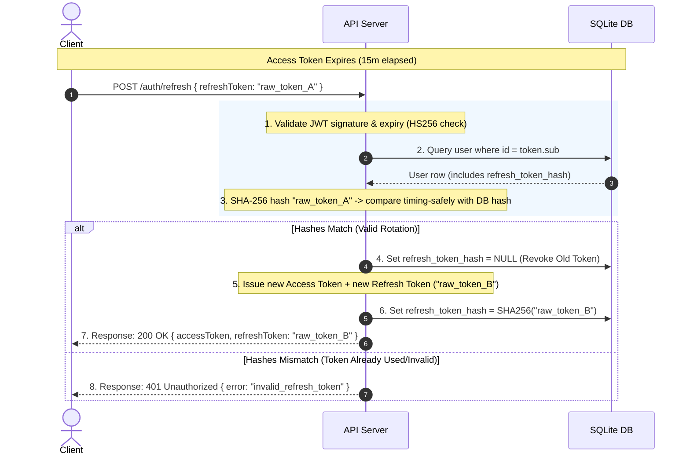

# Authentication & Refresh-Token Rotation Runbook

This document details the design, lifecycle, endpoints, and security properties of the authentication system in **TalentTrust-Backend**.

---

## 1. Architectural Overview

TalentTrust-Backend implements two distinct authentication mechanisms depending on the route and context:

1. **Production-Grade JWT Authentication (Secure)**:
   - Uses cryptographically signed JSON Web Tokens (JWT) using `HS256` (HMAC with SHA-256).
   - Implements **Refresh-Token Rotation (RTR)** to mitigate replay attacks.
   - Handled by:
     - [auth.service.ts](file:///c:/Users/DELL/Desktop/Talenttrust-Backend/src/services/auth.service.ts) (Core auth service)
     - [authorization.ts](file:///c:/Users/DELL/Desktop/Talenttrust-Backend/src/middleware/authorization.ts) (Access control middlewares, e.g., `requireAuth`)
     - [jwtConfig.ts](file:///c:/Users/DELL/Desktop/Talenttrust-Backend/src/auth/jwtConfig.ts) (JWT signature restrictions)
     - [auth.routes.ts](file:///c:/Users/DELL/Desktop/Talenttrust-Backend/src/routes/auth.routes.ts) (HTTP API endpoints)

2. **Legacy / Testing Bearer Token Scheme**:
   - A simplified, unsigned Bearer token scheme.
   - Used for unit testing and local sandbox route verification without cryptographic overhead.
   - Handled by:
     - [authenticate.ts](file:///c:/Users/DELL/Desktop/Talenttrust-Backend/src/auth/authenticate.ts)

---

## 2. JWT Authentication Lifecycle

```
  +------------+          +-------------+          +------------+
  |  Register  |  ---->   |    Login    |  ---->   | Request    |
  |  Account   |          |  Get Tokens |          | Protected  |
  +------------+          +-------------+          +----+-------+
                                                        |
                                                        | access token valid?
                                                        |
                                     Yes +--------------v--------------+ No
                                         |                             |
                                         |                             v
                                  [Allow Access]              +--------+--------+
                                                              |  Refresh Token  |
                                                              |    Rotation     |
                                                              +--------+--------+
                                                                       |
                                                     Valid refresh?    |
                                                                       |
                                                   Yes +---------------v---------------+ No
                                                       |                               |
                                                       v                               v
                                              [Issue New Tokens]             [Force Re-login]
```

The system manages user sessions using a dual-token strategy:

* **Access Token**:
  - **TTL**: 15 minutes (`15m`).
  - **Format**: JWT signed with `JWT_SECRET` using `HS256`.
  - **Payload Structure**:
    ```json
    {
      "sub": "usr_9b1deb4d-3b7d-4bad-9bdd-2b0d7b3d4f82",
      "email": "user@example.com",
      "role": "freelancer",
      "iat": 1719446400,
      "exp": 1719447300
    }
    ```
  - **Storage**: Sent in HTTP header: `Authorization: Bearer <access_token>`.

* **Refresh Token**:
  - **TTL**: 7 days (`7d`).
  - **Format**: JWT signed with `JWT_SECRET` using `HS256`.
  - **Payload Structure**:
    ```json
    {
      "sub": "usr_9b1deb4d-3b7d-4bad-9bdd-2b0d7b3d4f82",
      "tok": "3a0d9f4e...[32 bytes of secure random hex]"
    }
    ```
  - **Storage**: Stored in SQLite database under `users.refresh_token_hash` as a **SHA-256** hash of the raw token. The raw token is only returned to the client and never saved in plaintext.

---

## 3. Refresh-Token Rotation (RTR) Flow

To prevent unauthorized token reuse (replay attacks), refresh tokens are **single-use only**. Whenever a client requests a new access token using a refresh token:
1. The client presents the raw refresh token.
2. The server verifies the token's validity, decrypts the user ID (`sub`), and retrieves the stored hash from the database.
3. The server performs a timing-safe hash comparison.
4. On success, the server **immediately revokes** the old refresh token by removing its hash from the database.
5. A completely fresh access token + refresh token pair is issued to the client.
6. The SHA-256 hash of the new refresh token is saved in the database.

### Rotation Sequence Diagram



---

## 4. Key Security Properties

### A. Hashed Refresh Token Storage
Storing refresh tokens in plaintext is a security risk if the database is compromised. 
- The raw refresh token is parsed and hashed using **SHA-256** on the fly:
  ```typescript
  function hashRefreshToken(raw: string): string {
    return createHash("sha256").update(raw).digest("hex");
  }
  ```
- Only this hash is persisted. A database leak does not allow attackers to forge valid refresh sessions.

### B. Timing-Safe Comparisons
To prevent remote timing side-channel attacks (where an attacker deduces the secret character-by-character based on processing duration), the server compares both password hashes and refresh token hashes in constant time using Node's `crypto.timingSafeEqual`:
```typescript
const incoming = Buffer.from(hashRefreshToken(refreshToken), "hex");
const stored = Buffer.from(row.refresh_token_hash, "hex");

if (incoming.length !== stored.length || !timingSafeEqual(incoming, stored)) {
  // Reject
}
```

### C. Password Hashing with Scrypt
Passwords are typed and securely hashed using Node's native `scrypt` algorithm with a random 16-byte salt and standard cost parameters (`N = 16384, r = 8, p = 1`):
```typescript
const salt = randomBytes(16).toString("hex");
const hash = scryptSync(password, salt, 64, { N: 16384, r: 8, p: 1 });
```

### D. User-Enumeration Safe Errors
The authentication path employs strict measures to prevent attackers from determining if a specific email address exists in the system:
1. **Constant-Time Verification**: On login, if an email is not found, the service hashes a dummy password (``${"a".repeat(32)}:${"b".repeat(128)}``) to ensure that the request takes the same amount of time as a matching account check.
2. **Generic Error Messages**: Registration and login endpoints return generic codes and messages (e.g., `invalid_credentials` or `Registration failed. Please try again.`) without disclosing whether the password or the email was incorrect.

### E. Centralized JWT Configuration (Algorithm Confusion Mitigation)
To prevent algorithm-confusion vulnerabilities (e.g., where a verification library honors a token header specifying `alg: none` or swaps RSA public keys for HMAC validation), all token verification calls MUST use the centralized config in [jwtConfig.ts](file:///c:/Users/DELL/Desktop/Talenttrust-Backend/src/auth/jwtConfig.ts):
```typescript
export const JWT_VERIFY_OPTIONS = {
  algorithms: ["HS256"], // Restricts acceptable algorithms to HS256 only
};
```

---

## 5. API Reference

All requests and responses use the JSON content type.

### 1. Register User
Creates a new account and logs the user in immediately.

* **Endpoint**: `POST /auth/register` (typically mounted at `/api/v1/auth/register` or `/auth/register`)
* **Request Body**:
  ```json
  {
    "email": "developer@talenttrust.com",
    "password": "super-secure-password-123",
    "username": "talent_dev",
    "role": "freelancer"
  }
  ```
* **Success Response (201 Created)**:
  ```json
  {
    "accessToken": "eyJhbGciOiJIUzI1NiIsIn...",
    "refreshToken": "eyJhbGciOiJIUzI1NiIsIn..."
  }
  ```
* **Error Response (409 Conflict)**:
  ```json
  {
    "error": {
      "code": "conflict",
      "message": "Registration failed. Please try again."
    }
  }
  ```

### 2. Login
Authenticates an existing user and returns access and refresh tokens.

* **Endpoint**: `POST /auth/login`
* **Request Body**:
  ```json
  {
    "email": "developer@talenttrust.com",
    "password": "super-secure-password-123"
  }
  ```
* **Success Response (200 OK)**:
  ```json
  {
    "accessToken": "eyJhbGciOiJIUzI1NiIsIn...",
    "refreshToken": "eyJhbGciOiJIUzI1NiIsIn..."
  }
  ```
* **Error Response (401 Unauthorized)**:
  ```json
  {
    "error": {
      "code": "invalid_credentials",
      "message": "Invalid email or password."
    }
  }
  ```

### 3. Refresh Tokens
Rotates the session tokens using a valid refresh token.

* **Endpoint**: `POST /auth/refresh`
* **Request Body**:
  ```json
  {
    "refreshToken": "eyJhbGciOiJIUzI1NiIsIn..."
  }
  ```
* **Success Response (200 OK)**:
  ```json
  {
    "accessToken": "eyJhbGciOiJIUzI1NiIsIn...",
    "refreshToken": "eyJhbGciOiJIUzI1NiIsIn..."
  }
  ```
* **Error Response (401 Unauthorized)**:
  ```json
  {
    "error": {
      "code": "invalid_refresh_token",
      "message": "Invalid or expired refresh token."
    }
  }
  ```

### 4. Logout
Revokes the current user session by clearing the refresh token hash from the database.

* **Endpoint**: `POST /auth/logout`
* **Headers**: `Authorization: Bearer <access_token>`
* **Success Response (200 OK)**:
  ```json
  {
    "message": "Logged out successfully"
  }
  ```
